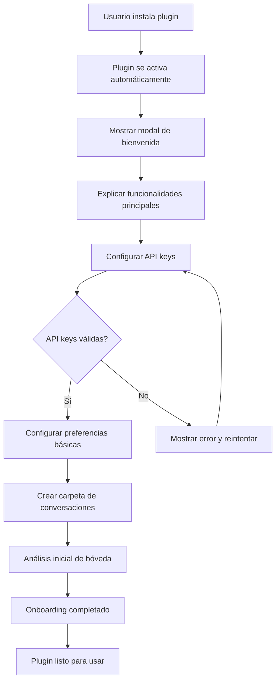
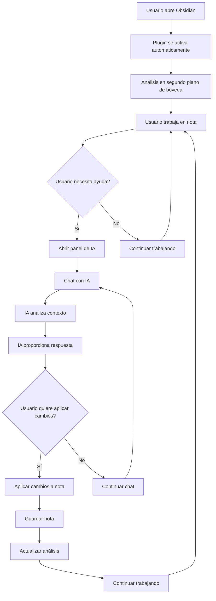
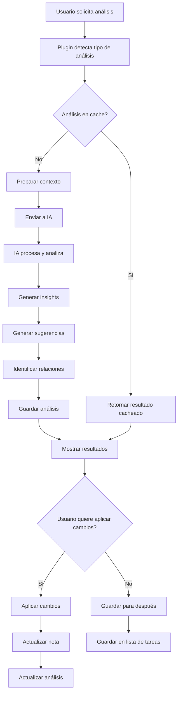
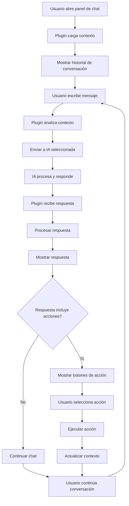
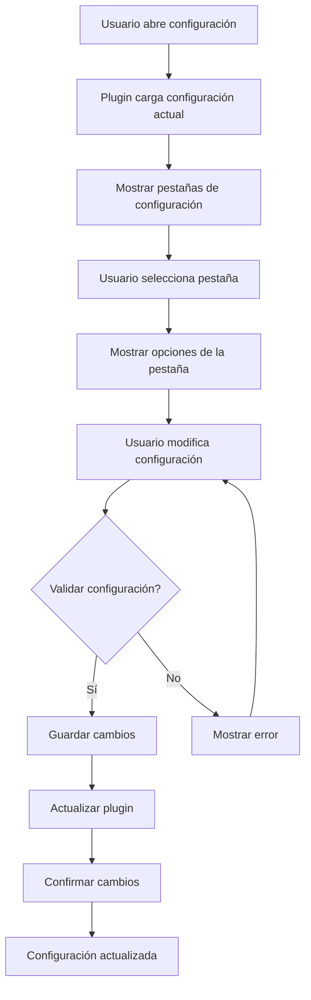
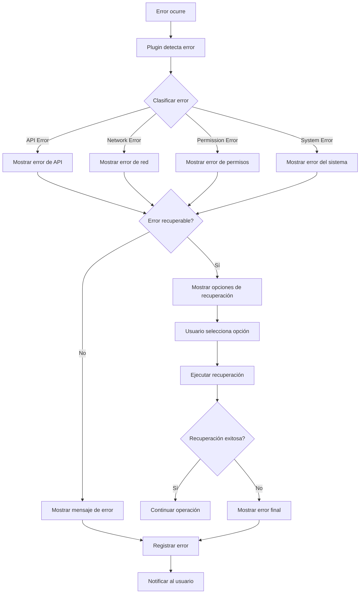
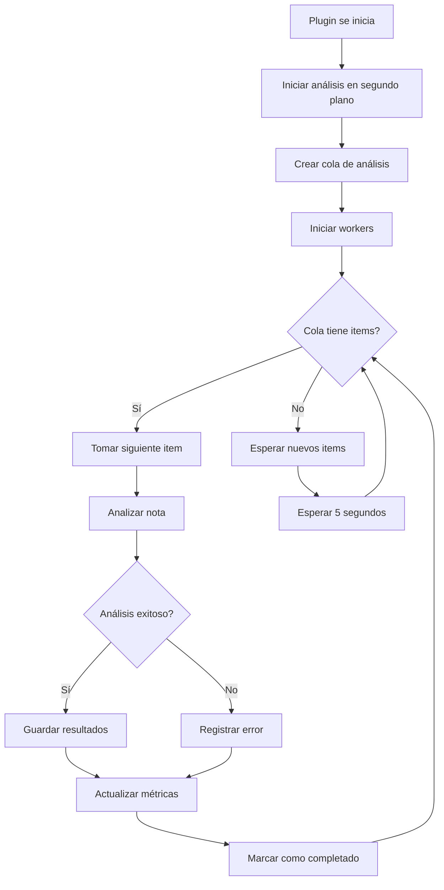
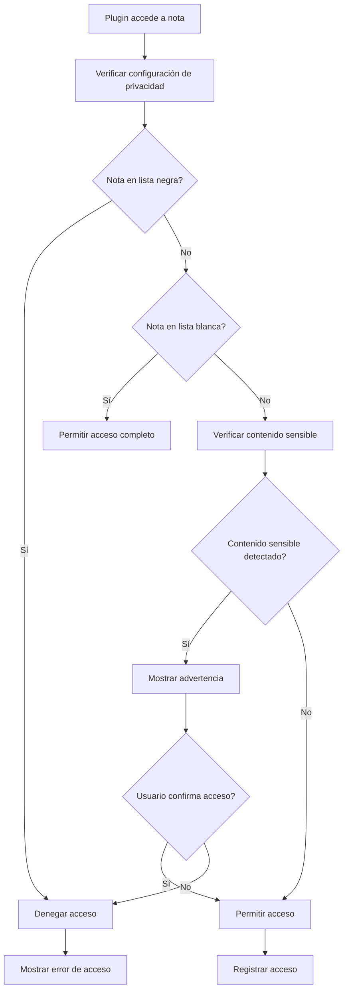
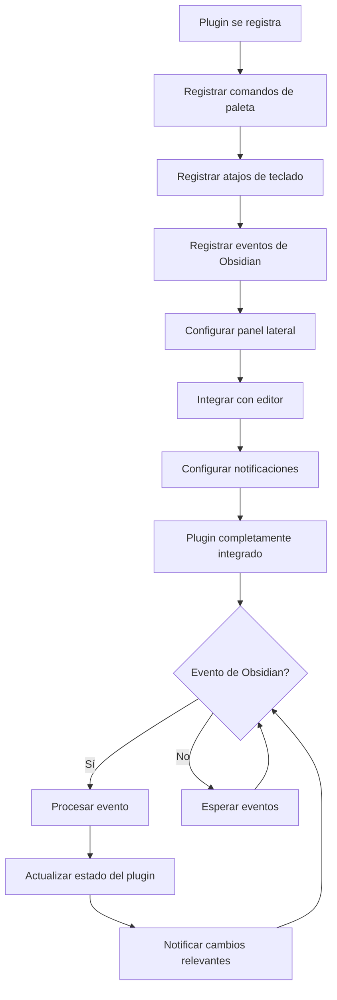
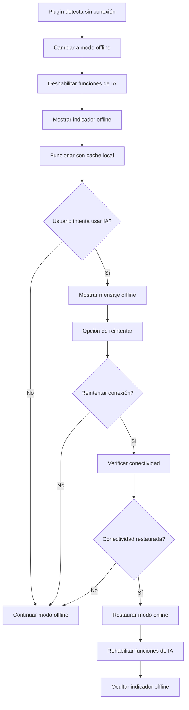

# User Flow Documentation
## Obsidian AI Assistant Plugin

### 1. Overview

#### User Flow Architecture
El plugin implementa flujos de usuario intuitivos que se integran naturalmente con el flujo de trabajo de Obsidian. Los flujos están diseñados para ser **contextuales**, **eficientes** y **no intrusivos**.

#### Flow Types
- **Onboarding Flow:** Configuración inicial del plugin
- **Core User Journey:** Flujo principal de uso del asistente de IA
- **Note Analysis Flow:** Análisis y mejora de notas
- **Chat Flow:** Interacción con la IA
- **Settings Flow:** Configuración y personalización

### 2. Onboarding Flow

#### Initial Setup Process

#### Onboarding Steps

**Step 1: Welcome Modal**
- **Trigger:** Instalación del plugin
- **Content:** 
  - Explicación de funcionalidades
  - Requisitos del sistema
  - Enlaces a documentación
- **Actions:** Botón "Comenzar configuración"

**Step 2: API Configuration**
- **Trigger:** Usuario hace clic en "Comenzar configuración"
- **Content:**
  - Formulario para Claude API key
  - Formulario para Gemini API key
  - Explicación de costos y límites
- **Actions:** 
  - Botón "Probar conexión"
  - Botón "Guardar y continuar"

**Step 3: Basic Preferences**
- **Trigger:** APIs configuradas exitosamente
- **Content:**
  - Selector de modelo predeterminado
  - Configuración de privacidad básica
  - Configuración de performance
- **Actions:** Botón "Continuar"

**Step 4: Vault Analysis**
- **Trigger:** Preferencias configuradas
- **Content:**
  - Progreso del análisis inicial
  - Estimación de tiempo
  - Opción de saltar
- **Actions:** Botón "Saltar" o esperar completar

### 3. Core User Journey

#### Main User Flow

#### Context-Aware Assistance

**Automatic Context Detection**
- **Trigger:** Usuario abre o edita una nota
- **Action:** Plugin detecta automáticamente:
  - Tipo de nota (desarrollo, escritura, etc.)
  - Contenido actual
  - Relaciones con otras notas
  - Oportunidades de mejora

**Smart Suggestions**
- **Trigger:** Cambios en la nota o contexto
- **Action:** IA sugiere automáticamente:
  - Mejoras de estructura
  - Enlaces a notas relacionadas
  - Contenido adicional
  - Reorganización

### 4. Note Analysis Flow

#### Analysis Process

#### Analysis Types

**Content Analysis**
- **Scope:** Contenido de la nota
- **Output:**
  - Sugerencias de mejora
  - Identificación de temas
  - Detección de inconsistencias
  - Recomendaciones de expansión

**Structure Analysis**
- **Scope:** Organización y formato
- **Output:**
  - Sugerencias de reorganización
  - Mejoras de formato
  - Estructura de encabezados
  - Uso de listas y tablas

**Relationship Analysis**
- **Scope:** Conexiones con otras notas
- **Output:**
  - Notas relacionadas
  - Enlaces sugeridos
  - Patrones de conexión
  - Oportunidades de consolidación

### 5. Chat Flow

#### Chat Interaction Process

#### Chat Context Management

**Context Building**
- **Current Note Context:**
  - Contenido de la nota actual
  - Metadatos y propiedades
  - Enlaces y referencias
  - Historial de cambios

**Vault Context:**
  - Estructura de carpetas
  - Notas relacionadas
  - Patrones de uso
  - Temas recurrentes

**Conversation Context:**
  - Historial de mensajes
  - Acciones realizadas
  - Preferencias del usuario
  - Estado de la sesión

### 6. Settings Flow

#### Settings Configuration Process

#### Configuration Tabs

**AI Models Tab**
- **API Keys:** Configuración y validación
- **Model Selection:** Selección de modelos
- **Cost Limits:** Límites de gasto
- **Performance:** Configuración de tokens

**Privacy Tab**
- **Content Detection:** Detección de contenido sensible
- **Access Control:** Control de acceso a notas
- **Data Export:** Configuración de exportación
- **Audit Logging:** Registro de auditoría

**Performance Tab**
- **Background Analysis:** Análisis en segundo plano
- **Cache Settings:** Configuración de cache
- **Memory Usage:** Límites de memoria
- **Worker Threads:** Hilos de trabajo

**UI Tab**
- **Panel Layout:** Configuración del panel
- **Theme Integration:** Integración con temas
- **Auto-suggestions:** Sugerencias automáticas
- **Keyboard Shortcuts:** Atajos de teclado

### 7. Error Handling Flow

#### Error Management Process

#### Error Types & Recovery

**API Errors**
- **Rate Limit Exceeded:** Esperar y reintentar
- **Invalid API Key:** Solicitar nueva clave
- **Quota Exceeded:** Mostrar opciones de upgrade
- **Service Unavailable:** Reintentar más tarde

**Network Errors**
- **Connection Timeout:** Reintentar con backoff
- **DNS Resolution:** Verificar conectividad
- **SSL Certificate:** Verificar certificados
- **Proxy Issues:** Configurar proxy

**Permission Errors**
- **File Access Denied:** Solicitar permisos
- **Plugin Permissions:** Verificar permisos del plugin
- **System Permissions:** Verificar permisos del sistema

### 8. Performance Optimization Flow

#### Background Analysis Process

#### Performance Monitoring

**Real-time Metrics**
- **Response Time:** Tiempo de respuesta de la IA
- **Memory Usage:** Uso de memoria del plugin
- **CPU Usage:** Uso de CPU del análisis
- **Cache Hit Rate:** Tasa de aciertos del cache

**Performance Alerts**
- **High Memory Usage:** Notificar al usuario
- **Slow Response Time:** Sugerir optimizaciones
- **Cache Miss Rate:** Ajustar estrategia de cache
- **Worker Queue Size:** Ajustar número de workers

### 9. Privacy & Security Flow

#### Privacy Check Process

#### Security Measures

**Content Detection**
- **Pattern Matching:** Detectar patrones sensibles
- **Keyword Detection:** Identificar palabras clave
- **ML-based Detection:** Detección basada en ML
- **User-defined Rules:** Reglas personalizadas

**Access Control**
- **Note-level Permissions:** Permisos por nota
- **Folder-level Permissions:** Permisos por carpeta
- **User-defined Rules:** Reglas personalizadas
- **Audit Logging:** Registro de acceso

### 10. Integration Flow

#### Obsidian Integration Process

#### Integration Points

**Command Palette Integration**
- **AI Assistant: Open Chat:** Abrir panel de chat
- **AI Assistant: Analyze Note:** Analizar nota actual
- **AI Assistant: Analyze Vault:** Analizar bóveda completa
- **AI Assistant: Settings:** Abrir configuración

**Editor Integration**
- **Context Menu:** Menú contextual en editor
- **Auto-suggestions:** Sugerencias automáticas
- **Inline Actions:** Acciones en línea
- **Status Bar:** Indicadores en barra de estado

**Event Integration**
- **File Changes:** Cambios en archivos
- **Active Leaf Changes:** Cambios en pestañas activas
- **Vault Changes:** Cambios en la bóveda
- **Theme Changes:** Cambios de tema

### 11. User Experience Enhancements

#### Smart Notifications

**Contextual Notifications**
- **Analysis Complete:** Notificar cuando el análisis esté listo
- **Suggestions Available:** Notificar nuevas sugerencias
- **Relationships Found:** Notificar nuevas relaciones
- **Performance Issues:** Notificar problemas de performance

**Non-intrusive Design**
- **Toast Notifications:** Notificaciones temporales
- **Status Bar Updates:** Actualizaciones en barra de estado
- **Progress Indicators:** Indicadores de progreso
- **Background Processing:** Procesamiento en segundo plano

#### Accessibility Features

**Keyboard Navigation**
- **Tab Navigation:** Navegación por tabulación
- **Shortcut Keys:** Teclas de acceso rápido
- **Focus Management:** Gestión del foco
- **Screen Reader Support:** Soporte para lectores de pantalla

**Visual Enhancements**
- **High Contrast Mode:** Modo de alto contraste
- **Font Scaling:** Escalado de fuentes
- **Color Blind Support:** Soporte para daltonismo
- **Motion Reduction:** Reducción de movimiento

### 12. Edge Cases & Alternative Flows

#### Offline Mode Handling

#### Alternative User Flows

**Guest Mode**
- **Trigger:** Usuario sin configuración
- **Features:** Funcionalidades limitadas
- **Limitations:** Sin análisis de IA
- **Upgrade Path:** Configuración completa

**Demo Mode**
- **Trigger:** Usuario explora funcionalidades
- **Features:** Funcionalidades simuladas
- **Data:** Datos de ejemplo
- **Conversion:** Configuración real

**Expert Mode**
- **Trigger:** Usuario avanzado
- **Features:** Configuraciones avanzadas
- **Customization:** Personalización completa
- **Performance:** Optimizaciones avanzadas

### 13. Success Metrics & User Feedback

#### User Success Indicators

**Engagement Metrics**
- **Daily Active Users:** Usuarios activos diariamente
- **Session Duration:** Duración de sesión
- **Feature Usage:** Uso de funcionalidades
- **Return Rate:** Tasa de retorno

**Quality Metrics**
- **User Satisfaction:** Satisfacción del usuario
- **Error Rate:** Tasa de errores
- **Response Time:** Tiempo de respuesta
- **Accuracy:** Precisión de la IA

**Business Metrics**
- **User Retention:** Retención de usuarios
- **Feature Adoption:** Adopción de funcionalidades
- **Support Requests:** Solicitudes de soporte
- **User Feedback:** Comentarios de usuarios

#### Feedback Collection

**In-app Feedback**
- **Rating System:** Sistema de calificación
- **Feedback Forms:** Formularios de comentarios
- **Bug Reports:** Reportes de errores
- **Feature Requests:** Solicitudes de funcionalidades

**User Research**
- **User Interviews:** Entrevistas con usuarios
- **Usability Testing:** Pruebas de usabilidad
- **A/B Testing:** Pruebas A/B
- **Analytics:** Análisis de uso
